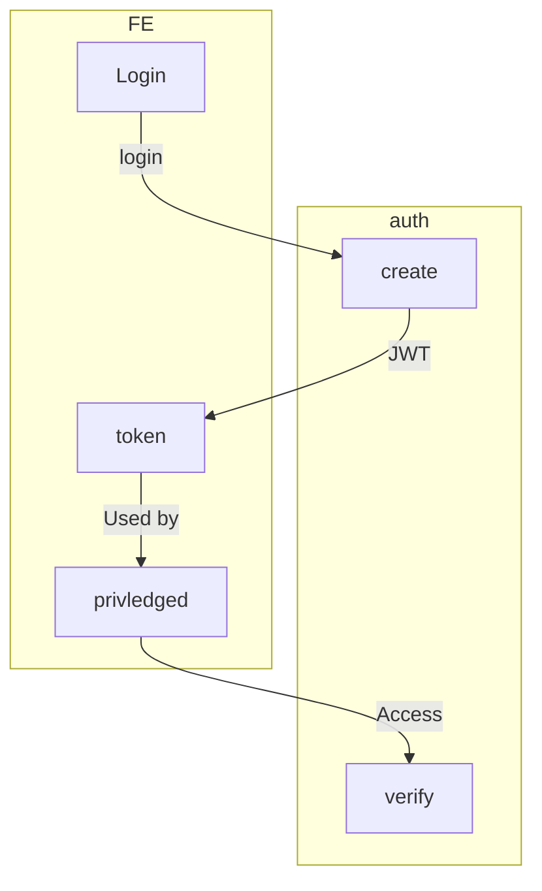

# Authentication notes
Need some form of authentication to implement access controls and just to verify users.

## Dirty Auth
Request for Auth again, this time it was clearer what was being asked for.



For the Dirty Auth solution, the JWT is simply a AES encrypted JSON object that contains a UNIX EPOCH (For a time stamp) and user id (For uniqueness). This allows for stateless verification of authorisation.

### Tech used

Crypto example in ts provided below, this is verified to work.
```ts
import * as crypto from 'crypto';

const algorithm = 'aes-256-cbc';
// Key changes everytime
//const key = crypto.randomBytes(32);
// Static key
const secret = "Nevada";
const key = crypto.createHash('sha256').update(secret).digest().slice(0, 32);
const iv = crypto.randomBytes(16);

//// In express function, after reading in from body
const { email } = req.body;
// Crypto buffers I believe
const cipher = crypto.createCipheriv(algorithm, key, iv);
const decipher = crypto.createDecipheriv(algorithm, key, iv);
if (email) {
  console.log(email);
  const encrypted = cipher.update(email, 'utf8', 'hex');
  const enc  = encrypted+cipher.final('hex');
  console.log(enc);
  const decrypted = decipher.update(enc, 'hex', 'utf8');
  const dec = decrypted+decipher.final('utf8');
  console.log(dec);
}
```

The token needs to be useable to Identify the owner and verify its valididity
```ts
interface DirtyJWT {
  userID: string;
  Epoch: number;
}

const token: DirtyJWT = {
Epoch: Math.floor(Date.now() / 1000),
userID: user.id
};

```


## [Auth.js](https://authjs.dev/) notes

## Implementation following [this guide](https://benjamin-chavez.com/blog/integrating-next.js-with-express.js-using-auth0-for-authentication)
***WARNING THIS NEVER WORKED FOR ME*** and I don't care enough to ever make it work for me anymore. Not like anyone reads this anyway.
- Integrate your own backend API with the new Next.js app directory
  - REST API
  - Server and Client code seperated
    - Next.js client
    - Express.js server

### Requirement before starting
- 0AUTH config
  - Not defined in this guide.
  - Ironically if you had this already the guide would be pointless.
  - Does not work without this or explain what this is or how to get your own... Great.
- pnpm 
  - Just delete it, it only exists to cause errors.


### Introduction
This can be added to config files for next js eg in [frontend](https://github.com/NevadaComp4050/VivaMQ/blob/main/frontend/next.config.mjs). This allows for redirection from an source api to another destination.
- The contents of the return appears to be in JSON format, or at least is an array of redirects.
```js
/** @type {import('next').NextConfig} */
const nextConfig = {
  async rewrites() {
    return [
      {
        source: '/api/:path*',
        destination: 'http://localhost:5000/api/:path*',
      },
    ];
  },
};
 
module.exports = nextConfig;
```

### Middleware
The [definition](https://nextjs.org/docs/app/building-your-application/routing/middleware) provided by Next.js, descripes what the redirect does. Apparently middleware can be used to enable client side authentication.
```
Middleware allows you to run code before a request is completed. Then, based on the incoming request, you can modify the response by rewriting, redirecting, modifying the request or response headers, or responding directly. Middleware runs before cached content and routes are matched.
```
The main benefit to us however is it increased modularity by seperating the authorisation logic from the rest of the application increasing modularity.

This code should be placed inside a `middleware.ts` file in either `/src` or  ` / ` according to GPT. Apparently this is a standard.
```js
import { withMiddlewareAuthRequired } from '@auth0/nextjs-auth0/edge';

export default withMiddlewareAuthRequired();

/* Can be left empty (no matcher) for all routes to require authentication */
export const config = {
    matcher: ['/private/:path*', '/api/:path*'],
};
```

