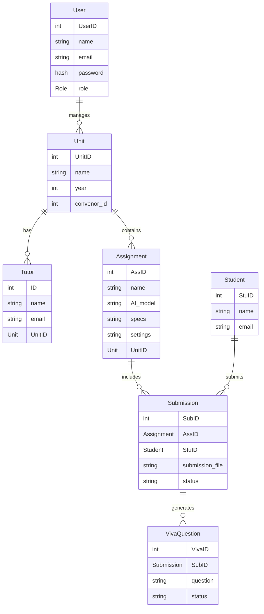
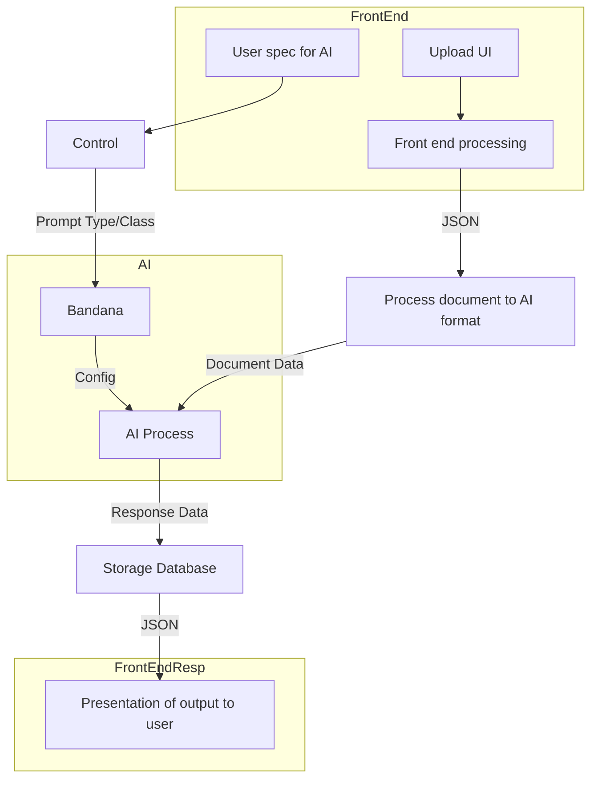

# Frontend

## Entity Relation model

# Backend
- Each process particular to backend should be wrapped in buffers
	- Inbox and outbox effectively
	- For bottlenecks more processing power could be allocated to accelerate processing
- Admin controls are needed.
	- [Authentication](Authentication) needed [https://authjs.dev/](https://authjs.dev/) recommended.
- [Database](Database) needs to be set up [Prisma.io](https://www.prisma.io/) recommended.
- Multiple parallel dataflows will be needed (Different users with different data)

## Pipe and filter model of the Dataflow through the system

