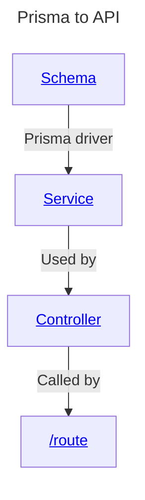

# Database notes

## [Prisma](https://www.prisma.io/) notes
Dev requested that this be implemented for this project.

### Description
Node.js and TypeScript [ORM](ORM.md)

### Usage
These are the files that must be changed in order to present an API recognisable by [Swagger](Swagger.md)

### Dependencies
