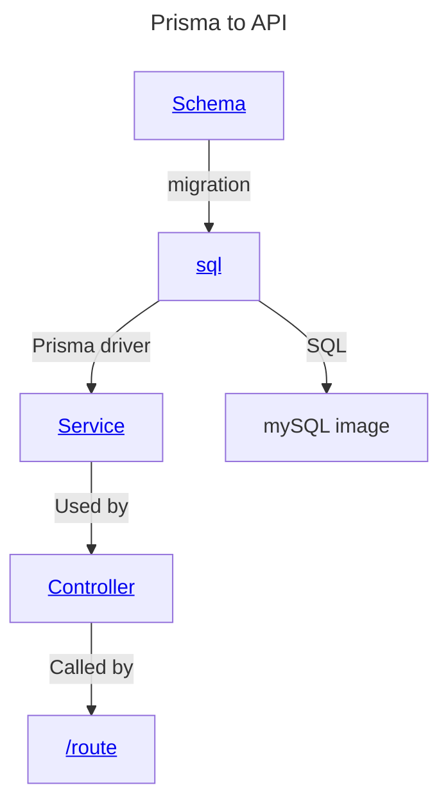

# Database notes

## [Prisma](https://www.prisma.io/) notes
Dev requested that this be implemented for this project.

### Description
Node.js and TypeScript [ORM](ORM.md).
Prisma is a tool that allows for manipulation of the database via its CLI, as part of this process it generates a module that wraps the database in typescript.

### Usage

#### CLI
Most common commands used will be `npx prisma migrate dev` and `npx generate`, there is a [full list of commands](https://www.prisma.io/docs/orm/reference/prisma-cli-reference) available at their website. Migrate or Push are used to execute a SQL script to configure the database. Generate is used to create the typescript wrapper for the database.

#### Typescript
These are the files that must be changed in order to present an API recognisable by [Swagger](Swagger.md)

### Dependencies
- npm / npx
- npm install called in backend
  - The generated files are in node-modules