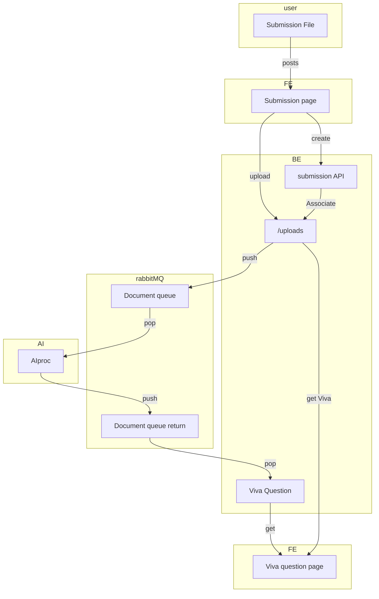

# MVP integration / design
We have the components to build a working system. Now all we need to do is bring them together.

## FE
- Call BE API endpoints
  - Post a file
  - Tag the file
- Render response
  - GetAll Viva, eventually the response will be there

### Short list of endpoints
endpoints are found in [backend/src/modules](../../backend/src/modules) each module contains a route with defined endpoints.

If you want to test these endpoints follow these steps
1. get a mySQL container `docker compose up -d mysql` in root
2. `cd backend`
3. `cp .env.example .env` copy the env
4. `npm i`
5. `npx prisma migrate dev` sometimes neccessary, runs the SQL on the db.
6. `npx prisma generate` usually unneccessary, gets prisma working.
7. `npm run dev`
8. open [swagger](http://localhost:8080/v1/swagger)
   - most of these APIs have a "tryme"
   - FileIO doesn't work via swagger, please see [FileHandling #usage](fileHandling.md#Usage).

## BE
- Submission
  - Combine file and submission data
- RabbitMQ
  - Post pdf to the queue
  - Pull response off resonse queue
    - Create a viva entry and save the response

## AI
- Wait for a pdf on the queue
- Process it and output to other channel

## Dataflow

