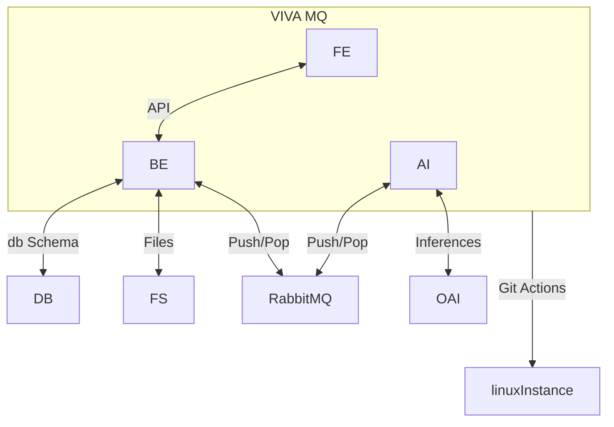

Attendees
- Deb
- Adrian
- Aaron
- Ben
- Ivan

- Drawing a system diagram

- We are getting an azure key
- SupaBase
    - Should take 5min
    - Yields a URL
- UploadThing
    - S3 instance
- Adrian: lack of time
    - Can give one full day
    - Agreed to keep track of progress

Action Items
- Ivan: SupaBase
    - Get a URL
- Ben: API Routes
    - Get them to match the MVP demoed in week 8
- Deb: Jest testing walkthrough
    - Next week
